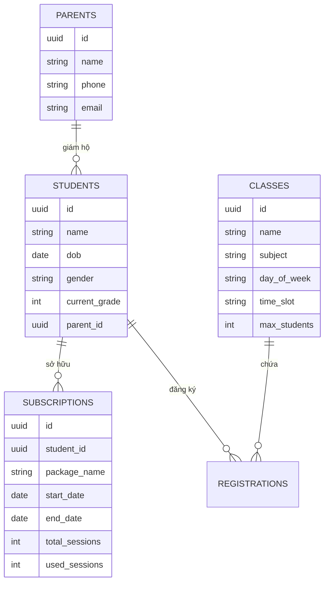

# Teencare LMS Mini-App (Fullstack NestJS + ReactJS)

Bài kiểm tra kỹ thuật - Vị trí Product Builder.

## 🌟 Công nghệ sử dụng
- **Backend:** NestJS, TypeORM, PostgreSQL.
- **Frontend:** ReactJS (Vite), Tailwind CSS, TypeScript.
- **DevOps:** Docker & Docker Compose.

## 🎯 Chức năng nổi bật (Nghiệp vụ cốt lõi)
1. **Chống Overbooking Lớp Học:** Sử dụng Pessimistic Locking (Khóa bi quan DB) qua cấu trúc `setLock('pessimistic_write')` trong Database Transaction (TypeORM) để tránh lỗi đếm ảo sĩ số lớp nếu 2 phụ huynh bấm đăng ký cùng 1 mili-giây. 
2. **Kiểm tra Trùng Lịch tự động (Schedule Overlaping):** Chuyển đổi khung giờ String `18:00-19:30` thành đơn vị minutes để check giao thoa lịch. Không cho phép học sinh học 2 lớp đè giờ lên nhau.
3. **Logic Hủy Lớp Tinh Tế:** Hàm Delete tự đoán ngày diễn ra buổi học sắp tới ở tương lai (căn cứ theo day_of_week hiện tại), tính thời gian cách móc học và quyết định: **Hoàn 1 buổi vào gói Subscription** nếu `> 24h`, hoặc **Không hoàn** nếu `< 24h`.
4. **Auto Sync Database:** Mode synchronize Schema (Dành cho bản testing) chạy 1 phát tự ra hết bảng.

## 🚀 Hướng dẫn chạy tự động chuẩn CI/CD (Docker Compose)
1. Cài đặt Docker trên máy.
2. Từ thư mục dự án gốc (Thư mục chứa `docker-compose.yml`), chạy:
   ```bash
   docker-compose up --build
   ```
3. Truy cập Front-end: `http://localhost:3003`

---

## 📊 Database Schema (PostgreSQL)

Dự án sử dụng Relational Database với cấu trúc tối ưu cho logic quản lý lớp học. Sơ đồ thực thể (ERD):



---

## 🛠️ Danh sách API chính & Ví dụ truy vấn

### 1. Phụ huynh & Học sinh
- **Tạo Phụ huynh:** `POST /api/parents`
- **Tạo Học sinh:** `POST /api/students`
- **Xem chi tiết:** `GET /api/students/{id}` (Kèm thông tin Parent)

### 2. Lớp học & Đăng ký
- **Lấy danh sách theo ngày:** `GET /api/classes?day=Chủ Nhật`
- **Đăng ký vào lớp:** `POST /api/classes/{class_id}/register` (Kiểm tra: Lớp đầy, Trùng lịch, Gói học).
- **Hủy lịch:** `DELETE /api/registrations/{id}` (Hoàn buổi nếu > 24h).

---

## 🧪 Dữ liệu mẫu (Seed Data)
Frontend có sẵn nút **"Bơm Test Data"** để nạp:
- 2 phụ huynh mẫu.
- 3 học sinh liên kết.
- 3 lớp học với các khung giờ chồng lấn.
- 3 gói Subscriptions với trạng thái khác nhau.

---

## 🛠️ (Tùy chọn) Chạy cục bộ phục vụ cho Live Code
### 1. Chạy CSDL (Postgres):
```bash
docker-compose up postgres -d
```
### 2. Backend (3000): `cd backend && npm install && npm run start:dev`
### 3. Frontend (3003): `cd frontend && npm install && npm run dev`


> **Lưu ý test API:** Dự án chạy tự động tạo các collection rỗng, vui lòng sử dụng Postman POST vào `http://localhost:3000/api/classes`, `api/students`, `api/subscriptions` để chèn dữ liệu mẫu gốc trước khi vào giao diện Test.
